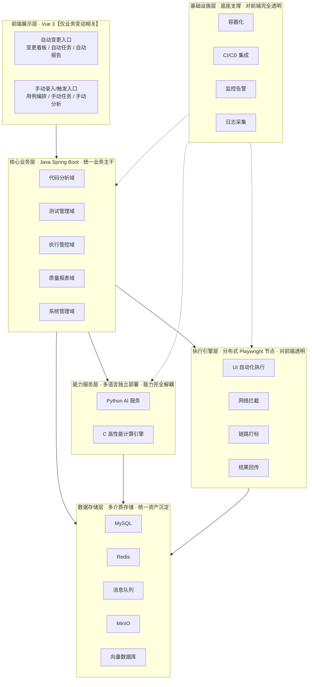
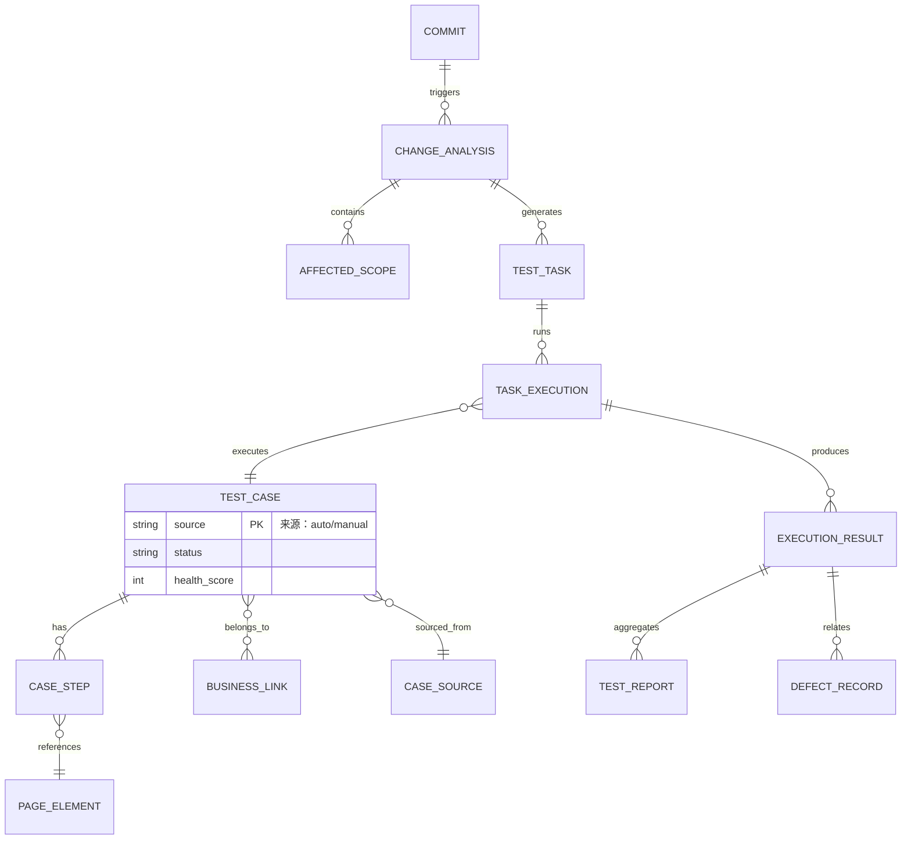
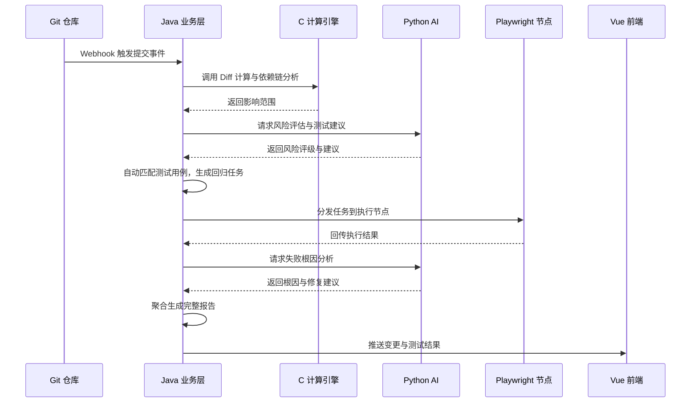
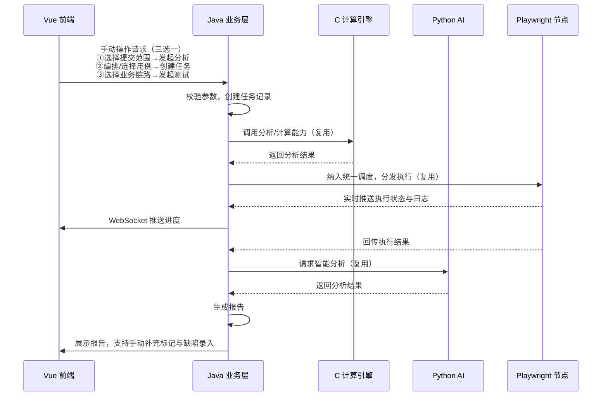
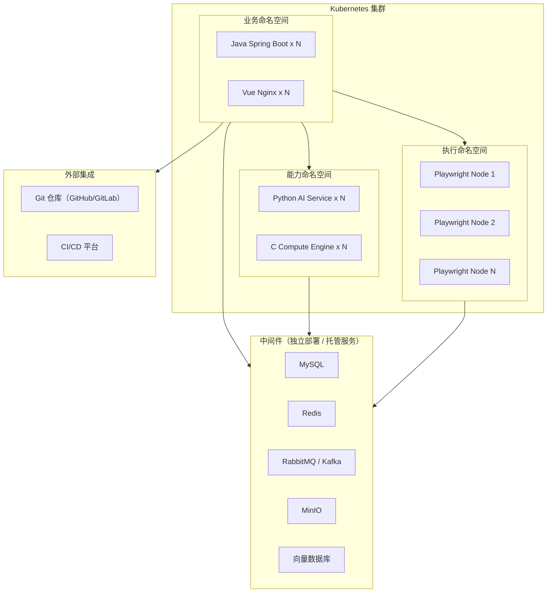

# 整体架构重梳理：双模式驱动的Web自动化测试平台

在原有「变更驱动自动化闭环」基础上，完整补充**手动录入与手动触发**能力，形成「自动驱动 + 人工操作」双模式并行体系。所有手动操作均聚焦业务维度，前端不涉及底层引擎、节点、资源等运维类功能，严格遵循「前端只关注业务变动相关功能」的边界约定。

## 一、架构核心定位与双模式边界

### 1. 核心定位

以代码业务变动为核心主线，同时支持全链路人工手动操作，共用同一套用例资产、执行引擎、分析能力与报表体系，兼顾**常态化自动回归**与**灵活按需测试**两大场景。

### 2. 双模式边界说明

| 模式 | 触发方式 | 适用场景 | 核心价值 |
|------|----------|----------|----------|
| 变更驱动自动模式 | Git 提交 Webhook 自动触发，全程无需人工干预 | 日常迭代回归、代码门禁、版本全量校验 | 降本提效，保障基础质量底线 |
| 人工手动模式 | 用户在前端手动录入 / 选择后触发 | 专项功能验证、临时回归、新功能用例录入、自定义范围测试 | 灵活可控，满足个性化测试需求 |

### 3. 多语言分工

| 语言 | 定位 | 服务范围 |
|------|------|----------|
| **Java** | 业务主干 | 承载手动与自动模式的业务逻辑与数据持久化 |
| **Python** | AI 能力底座 | 同时服务自动与手动场景的智能分析 |
| **C** | 高性能计算引擎 | 统一提供解析与计算能力 |
| **Vue** | 业务交互入口 | 同时提供自动看板与手动录入操作入口 |

---

## 二、整体分层架构总览

**层间调用原则：**

- 前端只调用 Java 业务层，不直接访问能力服务层与执行引擎层
- Java 业务层通过 HTTP/gRPC 调用 Python 与 C 服务，通过消息队列调度执行节点
- 能力服务层与执行引擎层不感知触发模式，只接收标准化输入、输出标准化结果

---

## 三、各层详细设计（重点补充手动录入能力）

### 1. 前端展示层（Vue 3）—— 业务侧双入口

技术栈保持不变，所有功能围绕业务变动展开，每个业务模块同时承载「自动展示」与「手动操作」两类能力。

#### （1）代码变更分析看板

| 优先级 | 能力类型 | 功能描述 |
|--------|----------|----------|
| P0 | 自动 | 实时同步 Git 提交记录，展示提交列表、作者、变更规模、自动风险评级 |
| P0 | 自动 | 自动展示全量影响范围（前端页面/组件、后端接口/服务、数据库表） |
| P1 | 自动 | 自动展示 AI 生成的变更摘要与测试建议 |
| P0 | 手动 | 手动选择分支 + commit 范围，手动发起单次代码影响分析 |
| P1 | 手动 | 手动录入补充变更说明、业务背景，辅助 AI 分析与测试人员理解 |
| P1 | 手动 | 手动调整风险等级、标记核心变更点，修正自动分析的偏差 |
| P2 | 手动 | 手动勾选影响范围，生成自定义回归范围 |

#### （2）测试用例与业务链路管理

| 优先级 | 能力类型 | 功能描述 |
|--------|----------|----------|
| P0 | 自动 | AI 根据需求/页面自动生成测试用例与断言 |
| P0 | 自动 | 代码变更后自动标记受影响的用例与业务链路 |
| P1 | 自动 | 自动统计用例健康度，标记不稳定用例 |
| P0 | 手动 | 手动新增/编辑/删除测试用例，支持可视化步骤编排（选择元素 + 动作 + 断言） |
| P0 | 手动 | 手动维护元素对象库，录入元素定位符、别名、备份定位策略 |
| P1 | 手动 | 手动配置端到端业务链路，关联页面步骤与接口断言规则 |
| P1 | 手动 | 手动录入测试数据集、参数化变量、环境变量 |
| P2 | 手动 | 手动对用例打标签、分类、排序，自定义用例分组 |

#### （3）测试任务中心

| 优先级 | 能力类型 | 功能描述 |
|--------|----------|----------|
| P0 | 自动 | 代码变更后自动生成精准回归任务，支持自动执行 |
| P1 | 自动 | 定时任务自动触发，执行结果自动同步 |
| P0 | 手动 | 手动选择用例集/业务模块/业务链路，自定义创建测试任务 |
| P1 | 手动 | 手动配置执行环境、浏览器版本、并发数、重试策略 |
| P0 | 手动 | 手动触发执行、暂停、终止任务 |
| P2 | 手动 | 手动导入外部用例、批量创建任务 |

#### （4）质量报告中心

| 优先级 | 能力类型 | 功能描述 |
|--------|----------|----------|
| P0 | 自动 | 执行完成后自动生成测试报告、链路分析报告、变更质量报告 |
| P1 | 自动 | AI 自动分析失败根因、给出修复建议 |
| P1 | 自动 | 自动统计质量趋势、通过率分布 |
| P1 | 手动 | 手动标记失败用例的真实原因（业务缺陷 / 用例失效 / 环境问题） |
| P1 | 手动 | 手动录入缺陷信息，关联对应提交与用例 |
| P2 | 手动 | 手动调整报告结论、补充测试备注 |
| P2 | 手动 | 手动选择范围导出测试报告、缺陷清单 |

### 2. 核心业务层（Java）—— 统一业务主干

五大领域模块同时支撑自动与手动两种模式，共用数据模型与底层能力，仅触发入口不同。

#### （1）代码分析域

| 模式 | 职责 |
|------|------|
| 自动 | Webhook 监听提交事件，自动拉取代码、触发分析、生成回归任务 |
| 手动 | 提供手动分析接口，接收前端传入的提交范围/变更说明，执行相同分析逻辑 |
| 通用 | Diff 计算、依赖链调用、影响范围组装、测试用例匹配 |

#### （2）测试管理域

| 模式 | 职责 |
|------|------|
| 自动 | AI 生成用例自动入库、变更自动标记受影响用例、健康度自动计算 |
| 手动 | 提供用例/元素/业务链路/数据的全量 CRUD 接口，支持批量操作 |
| 通用 | 用例校验、元素合法性检查、业务链路一致性校验 |

#### （3）执行管控域

| 模式 | 职责 |
|------|------|
| 自动 | 变更触发/定时触发任务自动分发、调度执行 |
| 手动 | 接收手动任务创建请求，校验参数后纳入调度队列，执行逻辑与自动模式完全一致 |
| 通用 | 节点调度、负载均衡、状态同步、结果聚合 |

#### （4）质量报表域

| 模式 | 职责 |
|------|------|
| 自动 | 执行完成自动生成报告、AI 自动分析 |
| 手动 | 支持手动修正报告数据、录入缺陷、调整结论 |
| 通用 | 报告生成、数据统计、导出能力 |

#### （5）系统管理域

统一用户权限、环境配置、仓库配置，自动与手动模式共用权限体系。

### 3. 能力服务层与执行层

Python AI 服务、C 高性能计算引擎、Playwright 执行节点均**不感知触发模式**，只接收标准化输入、输出标准化结果，自动模式与手动模式完全复用同一套底层能力。

Python AI 服务内部采用 **Master-Slave Agent 架构**：MasterAgent 负责意图路由与结果聚合，5 个 Sub-Agent（RiskAnalysis / ChangeSummary / RootCause / CaseGeneration / SemanticMatch）各自封装单一 AI 能力。Agent 间通过进程内 async call 通信，各 Agent 可通过 Tool 框架调用 Java 后端 API 获取上下文数据。详细设计参见 [agent.md](../.trae/skills/项目规范/agent.md)。

> **注意**：以下场景可能产生模式差异，需在业务层适配而非能力层改造——
> - 手动模式需要**实时日志推送**（自动模式仅需完成通知），由 Java 层通过 WebSocket 转发执行节点日志
> - 手动模式预留**单步调试**扩展点（Phase 3），不影响当前执行引擎设计

---

## 四、核心数据模型概览

### 1. 核心实体关系

### 2. 双模式数据共用策略

| 策略 | 说明 |
|------|------|
| 统一存储 | 自动生成与手动录入的用例、元素、业务链路存储于同一套数据表，通过 `source` 字段区分来源 |
| 统一标识 | 所有实体均支持 `source = auto | manual | hybrid`，`hybrid` 表示自动生成后经手动修改 |
| 统一版本 | 用例与业务链路支持版本管理，每次编辑生成新版本，历史版本可追溯 |
| 统一健康度 | 自动执行与手动执行的结果统一计入用例健康度评分 |

---

## 五、双模式核心业务流程

### 流程 1：变更驱动自动全流程（原有闭环）

### 流程 2：手动录入触发全流程

### 流程差异对照

| 环节 | 自动模式 | 手动模式 |
|------|----------|----------|
| 触发 | Webhook 自动触发 | 前端手动操作触发 |
| 参数来源 | 自动提取提交信息 | 用户手动选择/录入 |
| 执行调度 | 自动分发 | 纳入同一调度队列，逻辑一致 |
| 状态通知 | 完成后通知 | 实时 WebSocket 推送 |
| 结果处理 | 自动生成报告 | 生成报告 + 支持手动补充 |
| 数据沉淀 | 自动入库 | 手动操作数据同样沉淀至资产库 |

---

## 六、智能体协同机制

### 1. Agent 架构概览

Python AI 服务采用 **Master-Slave Agent 架构**，一个 MasterAgent 统一负责意图理解与结果聚合，5 个 Sub-Agent 各自封装单一 AI 能力：

| Agent | 角色 | 触发场景 |
|-------|------|----------|
| **MasterAgent** | 意图路由 + 编排 + 聚合 | 所有 AI 请求的统一入口 |
| **RiskAnalysisAgent** | 代码变更风险等级评估 | Webhook 自动触发 / 手动分析 |
| **ChangeSummaryAgent** | 变更摘要与测试建议 | Webhook 自动触发 / 手动分析 |
| **RootCauseAgent** | 失败根因分析与修复建议 | 任务执行失败自动触发 / 手动标记 |
| **CaseGenerationAgent** | 测试用例自动生成 | AI 生成用例 / 手动辅助 |
| **SemanticMatchAgent** | 语义匹配关联用例 | 变更分析后自动匹配 / 手动搜索 |

### 2. Agent 编排策略

| 策略 | 场景 | 示例 |
|------|------|------|
| 并行编排 | Agent 间无依赖 | RiskAnalysis + ChangeSummary 同时执行 |
| 串行编排 | 后序依赖前序结果 | RiskAnalysis → SemanticMatch |
| 条件编排 | 满足条件才触发 | risk_level >= medium 时触发 SemanticMatch |

### 3. Human-in-the-Loop 检查点

| 检查点 | 说明 |
|--------|------|
| 风险等级调整 | AI 产出 risk_level 后，用户可手动调整（对应 riskLevelManual 字段） |
| 用例确认 | CaseGenerationAgent 生成用例后需人工确认才入库 |
| 失败标记 | RootCauseAgent 分析后，人工 ManualFailureMark 作为反馈闭环 |

### 4. Agent 降级策略

| 异常场景 | 降级方案 |
|----------|----------|
| LLM 调用失败 | 降级到规则引擎（当前 mock 逻辑即为降级实现） |
| Python AI 不可用 | Java 后端返回降级结果（ErrorCode.AI_UNAVAILABLE） |
| 工具调用超时 | 跳过该工具，使用已有上下文继续推理 |

> 详细 Agent 设计规范参见 [agent.md](../.trae/skills/项目规范/agent.md)

---

## 七、双模式协同与冲突解决机制

### 1. 资产协同规则

| 协同维度 | 规则 |
|----------|------|
| 资产共用 | 手动录入的用例、元素、业务链路自动纳入资产库，变更驱动时可自动匹配调用 |
| 数据互哺 | 手动标记的失败原因、缺陷分类用于训练 AI 根因分析模型，持续提升自动判断准确率 |
| 健康度统一 | 手动执行与自动执行的结果统一计入用例健康度评分 |
| 权限统一 | 同一套 RBAC 权限体系控制手动操作与自动任务的可见范围与操作权限 |

### 2. 冲突解决规则

| 冲突场景 | 解决策略 | 说明 |
|----------|----------|------|
| 手动修改了自动生成的用例，下次变更又自动生成同范围用例 | **保留手动修改版**，自动生成版标记为"建议更新"供用户选择合并 | 用例 `source` 从 `auto` 变为 `hybrid`，手动修改优先 |
| 手动调整风险等级 vs AI 自动评定风险等级 | **以手动标记为准**，AI 评定作为参考值保留 | 人工判断在风险评级上具有最终决策权 |
| 手动标记失败原因 vs AI 自动根因分析 | **以手动标记为权威标注**，AI 分析作为辅助参考 | 手动标记数据用于 AI 模型训练 |
| 两人同时编辑同一用例 | **乐观锁 + 最后修改胜出**，提示后编辑者冲突 | 编辑提交时校验版本号，冲突时提示用户合并 |
| 自动任务与手动任务争抢执行节点 | **手动任务优先**，自动任务排队等待 | 手动任务代表即时测试需求，优先级高于常规回归 |

---

## 八、异常流程与补偿机制

| 异常场景 | 检测方式 | 补偿策略 |
|----------|----------|----------|
| 执行节点宕机 | 心跳超时 / 任务状态长时间未更新 | 自动将任务迁移至健康节点重试，最多重试 3 次；超过重试次数标记任务失败并通知用户 |
| AI 服务超时/不可用 | 调用超时 / 熔断器触发 | 降级为基础报告（跳过 AI 分析），标记为"AI 分析未完成"，待服务恢复后支持手动触发补充分析 |
| C 计算引擎异常 | 返回错误码 / 响应超时 | 代码分析任务标记失败，支持用户手动重新触发分析 |
| 消息队列积压/不可用 | 队列深度告警 / 投递失败 | Java 层本地暂存任务，队列恢复后补偿投递；紧急情况支持同步调度降级 |
| Git 仓库不可达 | Webhook 触发失败 / Clone 异常 | 记录失败事件，支持用户手动重新触发；配置 Webhook 重试策略（指数退避，最多 5 次） |
| 用例元素定位失效 | 执行时 Playwright 定位失败 | 自动尝试备份定位策略；仍失败则标记用例为"不稳定"，通知维护人更新元素库 |

---

## 九、部署架构概览

### 1. 服务部署视图

### 2. 服务间通信方式

| 调用方 | 被调用方 | 通信方式 | 说明 |
|--------|----------|----------|------|
| Vue 前端 | Java 业务层 | HTTP REST + WebSocket | REST 用于业务操作，WebSocket 用于实时状态推送 |
| Java 业务层 | Python AI 服务 | HTTP REST | 同步调用，超时降级 |
| Java 业务层 | C 计算引擎 | gRPC | 高性能同步调用 |
| Java 业务层 | Playwright 节点 | 消息队列（RabbitMQ） | 异步任务分发，支持削峰填谷 |
| Playwright 节点 | Java 业务层 | HTTP 回调 + 消息队列 | 结果回传与状态同步 |

### 3. 执行节点伸缩策略

| 策略 | 说明 |
|------|------|
| 基础节点 | 常驻 2 个 Playwright 节点，保障最低执行能力 |
| 弹性伸缩 | 根据任务队列深度自动扩缩 Pod（HPA），最大节点数可配置 |
| 闲置回收 | 节点空闲超过阈值自动缩容，节省资源 |

---

## 十、演进路线

| 阶段 | 目标 | 核心交付 | 预期成果 |
|------|------|----------|----------|
| **Phase 1** | 变更驱动自动闭环 | Webhook 监听 → 代码分析 → 自动生成回归任务 → 执行 → 报告 | 实现代码变更到测试报告的全自动闭环 |
| **Phase 2** | 手动录入与触发能力 | 用例/元素/业务链路手动 CRUD → 手动创建任务 → 手动触发执行 → 手动补充报告 | 补齐人工操作能力，满足灵活测试需求 |
| **Phase 3** | 双模式深度协同 | 冲突智能合并、单步调试、AI 模型持续优化、精细化权限 | 自动与手动深度互哺，平台能力趋于成熟 |

> 每个 Phase 内部按 P0 → P1 → P2 优先级逐步交付，P0 为最小可用集合。
