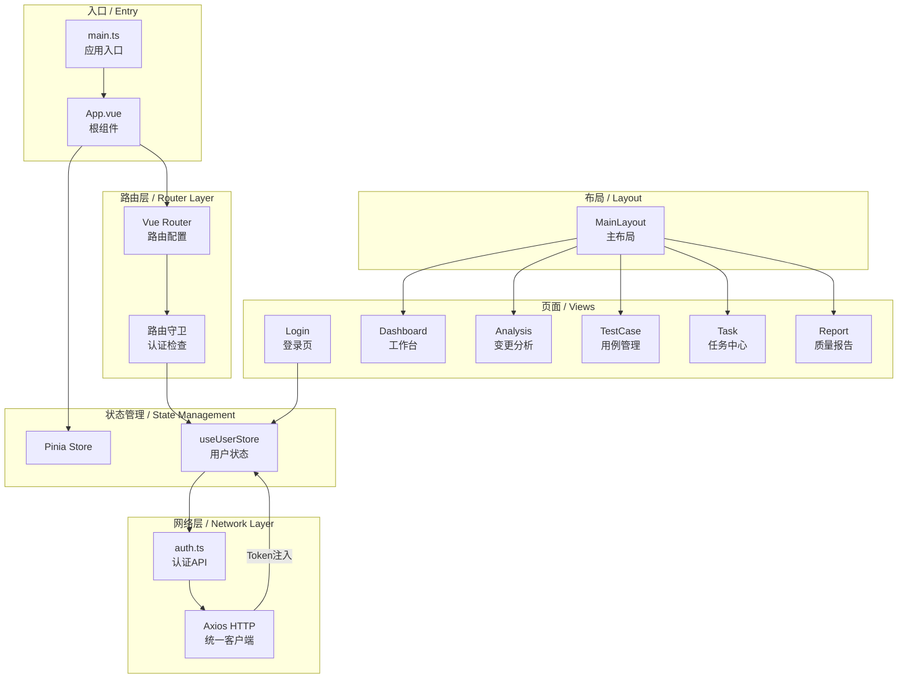
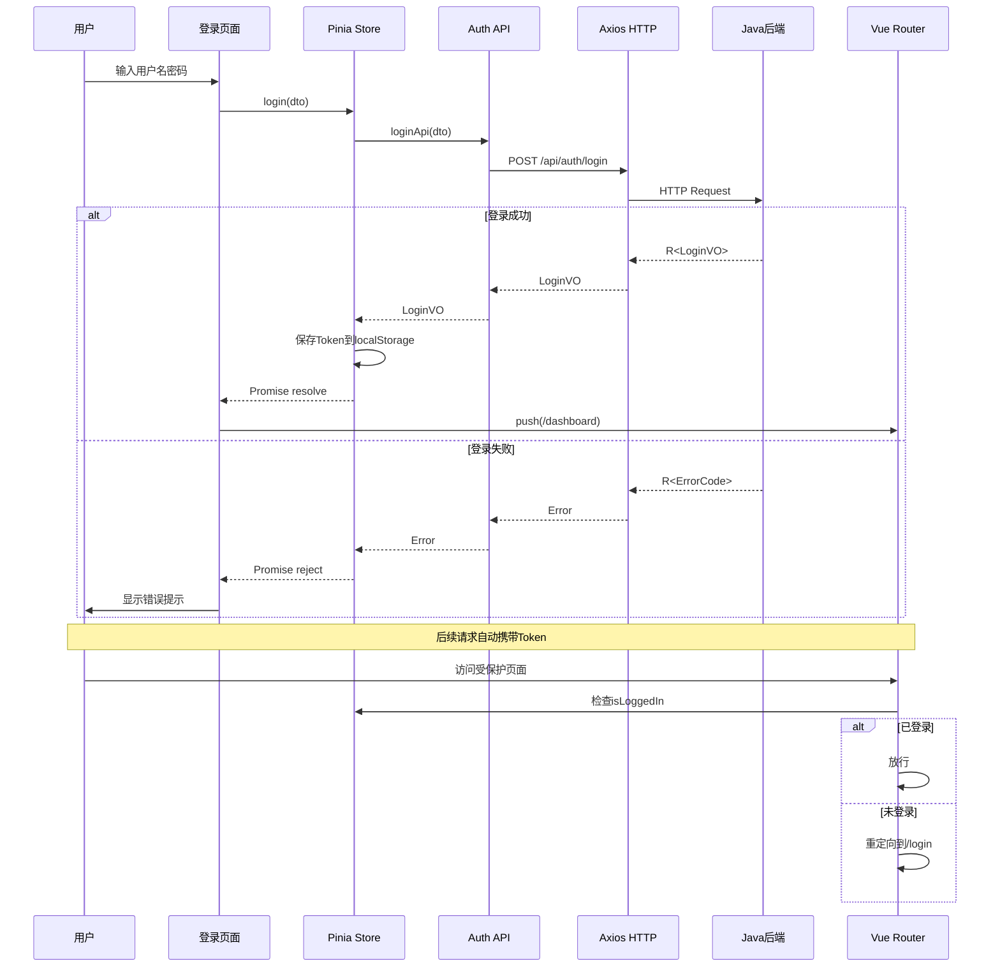
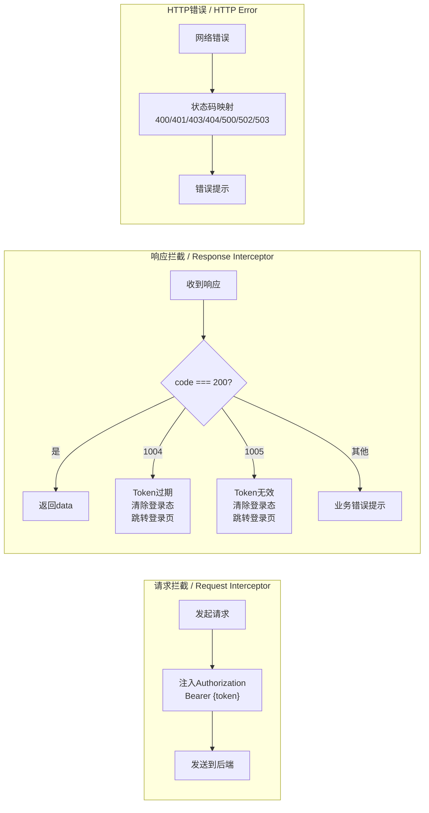

## 1. 高层摘要 (TL;DR)

**🎯 影响程度: 高** - 这是前端项目初始化，搭建了双模式驱动的Web自动化测试平台的前端骨架。

**✨ 关键变更:**

* 🏗️ 搭建了基于 Vite 6 + Vue 3 + TypeScript + Ant Design Vue 4 + Pinia + Vue Router 的完整前端技术栈

* 🔐 实现了完整的认证流程（登录页面 → Token管理 → 路由守卫 → 自动跳转）

* 🌐 建立了基于 Axios 的统一 HTTP 客户端（请求/响应拦截器、Token注入、错误码处理）

* 📐 设计了包含5个功能模块的主布局（工作台/变更分析/用例管理/任务中心/质量报告）

* 📦 配置了 Ant Design Vue 按需加载 + API 自动导入，优化打包体积

***

## 2. 视觉概览 (架构与业务流程)

### 2.1 前端整体架构图



### 2.2 认证流程图



### 2.3 HTTP 拦截器流程



***

## 3. 详细变更分析

### 3.1 📁 项目基础配置

**组件: Vite + TypeScript 工程配置**

| 文件路径 | 变更说明 |
|---------|---------|
| `package.json` | ✨ 新建 - 项目清单，定义依赖和脚本命令 |
| `vite.config.ts` | ✨ 新建 - Vite 构建配置，含插件、代理、分包策略 |
| `tsconfig.json` | ✨ 新建 - TypeScript 根配置 |
| `tsconfig.app.json` | ✨ 新建 - TypeScript 应用配置，包含编译选项和路径别名 |
| `env.d.ts` | ✨ 新建 - 环境变量和 Vite 类型声明 |
| `index.html` | ✨ 新建 - HTML 入口文件（lang="zh-CN"） |
| `.env` | ✨ 新建 - 基础环境变量（API地址、应用标题） |
| `.env.development` | ✨ 新建 - 开发环境变量 |
| `.env.production` | ✨ 新建 - 生产环境变量 |
| `.gitignore` | ✨ 新建 - Git 忽略规则 |
| `public/vite.svg` | ✨ 新建 - Favicon 图标 |

**关键配置项:**

| 配置项 | 值 | 说明 |
|--------|-----|------|
| Vite 版本 | 6.4.3 | 极速 HMR 构建工具 |
| TypeScript 版本 | 5.8.3 | 强类型支持 |
| Ant Design Vue | 4.2.6 | 企业级 UI 组件库 |
| 路径别名 | `@` → `src/` | 简化导入路径 |
| API 代理 | `/api` → `http://localhost:8080` | 开发环境代理后端 |
| WebSocket 代理 | `/ws` → `ws://localhost:8080` | 实时通信代理 |
| 构建目标 | ES2022 | 现代浏览器特性 |
| 分包策略 | vue-vendor + antd-vendor | 优化缓存和加载 |

**Vite 插件配置:**

| 插件 | 用途 |
|------|------|
| `@vitejs/plugin-vue` | Vue 3 SFC 支持 |
| `unplugin-vue-components` | Ant Design Vue 按需加载 + 自动注册 |
| `unplugin-auto-import` | Vue/Router/Pinia API 自动导入 |

***

### 3.2 🔐 认证与路由模块

**组件: 路由配置与认证守卫**

**路由表:**

| 路径 | 名称 | 组件 | 需认证 | 说明 |
|------|------|------|--------|------|
| `/login` | Login | `views/login/index.vue` | ❌ | 登录页面 |
| `/` | - | `layouts/MainLayout.vue` | ✅ | 主布局（重定向到 /dashboard） |
| `/dashboard` | Dashboard | `views/dashboard/index.vue` | ✅ | 工作台 |
| `/analysis` | Analysis | `views/analysis/index.vue` | ✅ | 变更分析 |
| `/testcase` | TestCase | `views/testcase/index.vue` | ✅ | 用例管理 |
| `/task` | Task | `views/task/index.vue` | ✅ | 任务中心 |
| `/report` | Report | `views/report/index.vue` | ✅ | 质量报告 |
| `/:pathMatch(.*)*` | - | - | - | 404 兜底重定向 |

**路由守卫逻辑:**

1. 设置页面标题：`{route.meta.title} - DeltaTest`
2. 检查 `to.meta.requiresAuth` 是否为 `false`
3. 若需认证，检查 `useUserStore().isLoggedIn`
4. 未登录则重定向到 `/login?redirect={原路径}`

**认证 Store (useUserStore):**

| 状态字段 | 类型 | 说明 |
|---------|------|------|
| `token` | `string` | JWT 访问令牌，持久化到 localStorage |
| `userId` | `number \| null` | 用户ID |
| `username` | `string` | 用户名 |
| `nickname` | `string` | 昵称 |
| `expiresIn` | `number` | 令牌过期时间（秒） |
| `isLoggedIn` | `computed<boolean>` | 是否已登录（基于 token 是否存在） |

| Action | 说明 |
|--------|------|
| `login(dto)` | 调用 loginApi → 保存 Token 和用户信息 → 持久化到 localStorage |
| `refreshToken()` | 调用 refreshTokenApi → 更新 Token → 持久化到 localStorage |
| `logout()` | 清空所有状态 → 移除 localStorage 中的 Token |

***

### 3.3 🌐 HTTP 客户端与 API 层

**组件: Axios 统一封装**

**统一响应体结构 (ApiResponse\<T>):**

```typescript
interface ApiResponse<T> {
  code: number      // 响应状态码
  message: string   // 响应消息
  data: T           // 响应数据
  timestamp: number // 响应时间戳
}
```

**请求拦截器:**

* 从 `useUserStore()` 获取 Token
* 自动注入 `Authorization: Bearer {token}` 请求头

**响应拦截器:**

| 错误码 | 处理方式 |
|--------|---------|
| `200` | 成功，返回 `data` 字段 |
| `1004` | Token 过期 → 清除登录态 → 跳转登录页 |
| `1005` | Token 无效 → 清除登录态 → 跳转登录页 |
| 其他 | 弹出错误提示 |
| HTTP 400 | 请求参数错误 |
| HTTP 401 | 未认证 |
| HTTP 403 | 无权限 |
| HTTP 404 | 资源不存在 |
| HTTP 500 | 服务器内部错误 |
| HTTP 502 | 上游服务不可用 |
| HTTP 503 | 服务暂不可用 |

**API 模块 (auth.ts):**

| 接口 | 方法 | 路径 | 请求参数 | 返回类型 |
|------|------|------|---------|---------|
| 用户登录 | POST | `/api/auth/login` | `LoginDTO` | `LoginVO` |
| 刷新Token | POST | `/api/auth/refresh` | Header: `Authorization` | `string` |
| 退出登录 | POST | `/api/auth/logout` | - | `void` |

**DTO/VO 类型定义:**

| 类型 | 字段 | 说明 |
|------|------|------|
| `LoginDTO` | username, password | 登录请求 |
| `LoginVO` | token, tokenType, expiresIn, userId, username, nickname | 登录响应 |

***

### 3.4 🎨 页面组件

**组件: 登录页面**

| 特性 | 说明 |
|------|------|
| 渐变背景 | `linear-gradient(135deg, #667eea, #764ba2)` |
| 居中卡片 | 宽 420px，圆角阴影 |
| Logo 图标 | `ThunderboltOutlined`（闪电图标） |
| 表单校验 | 用户名必填，密码必填且最少6位 |
| 登录成功 | 跳转到原始请求页或 `/dashboard` |
| 登录失败 | 弹出错误提示 |
| 底部版权 | © 2026 DeltaTest |

**组件: 主布局 (MainLayout)**

| 区域 | 说明 |
|------|------|
| 侧边栏 | 可折叠，宽 240px，深色主题，5个菜单项 |
| 顶部栏 | 折叠触发器 + 用户下拉菜单（退出登录） |
| 内容区 | 24px 外边距 + 24px 内边距，白色圆角卡片 |
| Logo 区 | 闪电图标 + "DeltaTest" 标题 |

**菜单项:**

| 菜单 | 图标 | 路由 |
|------|------|------|
| 工作台 | `DashboardOutlined` | `/dashboard` |
| 变更分析 | `CodeOutlined` | `/analysis` |
| 用例管理 | `FileSearchOutlined` | `/testcase` |
| 任务中心 | `ThunderboltOutlined` | `/task` |
| 质量报告 | `BarChartOutlined` | `/report` |

**组件: 工作台页面 (Dashboard)**

| 区域 | 说明 |
|------|------|
| 统计卡片 | 今日提交、高风险变更、执行中任务、通过率 |
| 快速入口 | 变更分析、用例管理、任务中心 |

**占位页面:**

| 页面 | 文件 | 说明 |
|------|------|------|
| 变更分析 | `views/analysis/index.vue` | 占位页面，后续迭代开发 |
| 用例管理 | `views/testcase/index.vue` | 占位页面，后续迭代开发 |
| 任务中心 | `views/task/index.vue` | 占位页面，后续迭代开发 |
| 质量报告 | `views/report/index.vue` | 占位页面，后续迭代开发 |

***

### 3.5 🏗️ 根组件与全局配置

**组件: App.vue**

| 特性 | 说明 |
|------|------|
| 国际化 | `a-config-provider` 设置 `zhCN` 中文语言包 |
| 日期库 | `dayjs` 设置中文 locale |
| 路由视图 | `<router-view />` 作为页面容器 |
| 全局样式 | `#app` 全屏、`html/body` 重置 |

**全局样式 (global.less):**

* CSS 变量定义（主色、成功色、警告色、错误色等）
* 全局滚动条美化
* Ant Design Vue 主题色覆盖

***

## 4. 影响与风险评估

### 4.1 ⚠️ 风险点

| 风险类型 | 描述 | 缓解措施 |
|---------|------|---------|
| **开发代理依赖** | 前端开发依赖后端服务在 `localhost:8080` 运行 | 可使用 Mock Service Worker (MSW) 独立开发 |
| **Token 存储安全** | Token 存储在 localStorage，存在 XSS 风险 | 后续可迁移到 HttpOnly Cookie |
| **Ant Design Vue 全量引入** | `main.ts` 中 `app.use(Antd)` 全量注册组件 | 已配置按需加载插件（unplugin-vue-components），实际打包仅包含使用到的组件 |
| **国际化简版** | 当前使用函数式 i18n，未引入 vue-i18n | 骨架阶段够用，Phase 3 可迁移到 vue-i18n |
| **占位页面** | 4个功能页面为占位实现 | Phase 1-2 按模块逐步开发 |

### 4.2 🚫 破坏性变更

**无破坏性变更** - 这是全新前端项目，无向后兼容性问题。

### 4.3 🧪 测试建议

**关键测试场景:**

1. **启动测试:**
   * ✅ `pnpm dev` 启动后可见登录页
   * ✅ `pnpm build` 可正常构建
   * ✅ `pnpm type-check` 类型检查通过

2. **认证流程测试:**
   * ✅ 登录页表单校验（用户名必填、密码最少6位）
   * ✅ 登录成功跳转到工作台
   * ✅ 未登录访问受保护页面重定向到登录页
   * ✅ 登录后 Token 自动注入请求头
   * ✅ 退出登录清除状态并跳转登录页

3. **路由测试:**
   * ✅ 5个菜单项路由跳转正常
   * ✅ 侧边栏菜单与路由高亮同步
   * ✅ 页面标题随路由变化
   * ✅ 浏览器刷新后路由守卫生效

4. **布局测试:**
   * ✅ 侧边栏折叠/展开正常
   * ✅ 用户下拉菜单退出登录正常
   * ✅ 响应式布局适配

5. **HTTP 客户端测试:**
   * ✅ 请求拦截器 Token 注入
   * ✅ 响应拦截器错误码处理
   * ✅ Token 过期自动跳转登录页

***

## 5. 技术栈总结

| 分层 | 技术/框架 | 版本 | 说明 |
|------|----------|------|------|
| **核心框架** | Vue 3 | 3.5.39 | Composition API + 响应式 |
| **构建工具** | Vite | 6.4.3 | 极速 HMR，Vue 官方推荐 |
| **语言** | TypeScript | 5.8.3 | 强类型约束 |
| **UI 组件库** | Ant Design Vue | 4.2.6 | 企业级组件 |
| **图标库** | @ant-design/icons-vue | 7.0.1 | 统一图标风格 |
| **路由** | Vue Router | 4.6.4 | SPA 路由管理 |
| **状态管理** | Pinia | 2.3.1 | 轻量、TypeScript 友好 |
| **HTTP 客户端** | Axios | 1.18.1 | 拦截器机制 |
| **日期库** | dayjs | 1.11.21 | 轻量日期处理 |
| **CSS 预处理** | Less | 4.6.7 | CSS 增强 |
| **代码规范** | ESLint + Prettier | 9.39.4 / 3.9.4 | 代码风格统一 |
| **类型检查** | vue-tsc | 2.2.12 | 编译期类型校验 |
| **按需加载** | unplugin-vue-components | 28.8.0 | Ant Design Vue 按需引入 |
| **自动导入** | unplugin-auto-import | 19.3.0 | Vue/Router/Pinia API 自动导入 |

***

## 6. 文件清单

| 文件路径 | 类型 | 说明 |
|---------|------|------|
| `package.json` | 配置 | 项目清单 |
| `pnpm-lock.yaml` | 锁定 | 依赖锁定文件 |
| `vite.config.ts` | 配置 | Vite 构建配置 |
| `tsconfig.json` | 配置 | TypeScript 根配置 |
| `tsconfig.app.json` | 配置 | TypeScript 应用配置 |
| `env.d.ts` | 声明 | 类型声明 |
| `index.html` | 入口 | HTML 入口 |
| `.env` | 环境 | 基础环境变量 |
| `.env.development` | 环境 | 开发环境变量 |
| `.env.production` | 环境 | 生产环境变量 |
| `.gitignore` | 配置 | Git 忽略规则 |
| `public/vite.svg` | 静态 | Favicon |
| `src/main.ts` | 入口 | 应用入口 |
| `src/App.vue` | 组件 | 根组件 |
| `src/router/index.ts` | 路由 | Vue Router 配置 |
| `src/stores/user.ts` | 状态 | Pinia 用户 Store |
| `src/utils/http.ts` | 工具 | Axios HTTP 客户端 |
| `src/api/auth.ts` | API | 认证 API 接口 |
| `src/layouts/MainLayout.vue` | 布局 | 主布局组件 |
| `src/views/login/index.vue` | 页面 | 登录页面 |
| `src/views/dashboard/index.vue` | 页面 | 工作台页面 |
| `src/views/analysis/index.vue` | 页面 | 变更分析（占位） |
| `src/views/testcase/index.vue` | 页面 | 用例管理（占位） |
| `src/views/task/index.vue` | 页面 | 任务中心（占位） |
| `src/views/report/index.vue` | 页面 | 质量报告（占位） |
| `src/assets/styles/global.less` | 样式 | 全局样式 |

***

## 7. 验收标准对照

| 验收标准 | 状态 | 说明 |
|---------|------|------|
| `pnpm dev` 启动后可见登录页 | ✅ 通过 | Vite 6.4.3 在 4106ms 内启动，http://localhost:5173/ 可访问登录页 |
| Vue 3 + TypeScript + Vite 集成 | ✅ 通过 | 所有 .vue/.ts 文件编译无错误 |
| Ant Design Vue 按需加载 | ✅ 通过 | unplugin-vue-components + AntDesignVueResolver 配置 |
| Pinia 状态管理 | ✅ 通过 | useUserStore 管理 Token、用户信息、登录状态 |
| Vue Router 路由守卫 | ✅ 通过 | 未登录重定向到登录页，登录后跳转工作台 |
| Axios HTTP 拦截器 | ✅ 通过 | Token 自动注入、错误码自动处理 |
| 与 Java 后端代理配置 | ✅ 通过 | /api 代理到 localhost:8080，/ws 代理 WebSocket |

***

**文档生成时间:** 2026-07-03  
**项目名称:** DeltaTest - 双模式驱动的Web自动化测试平台  
**模块:** M0.2 Vue 骨架  
