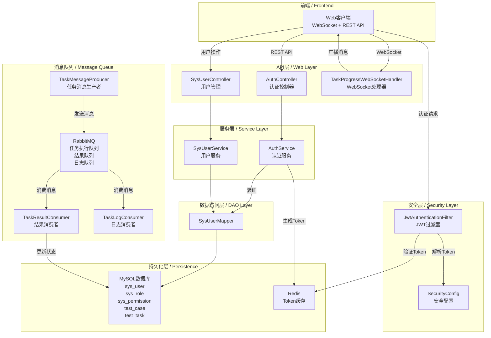
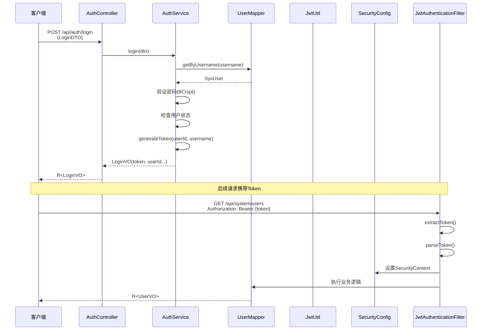
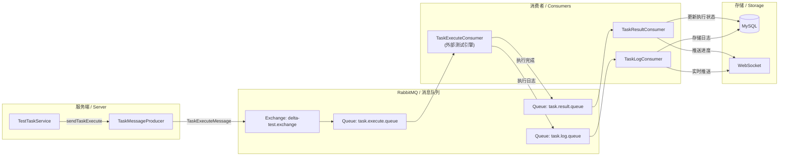

## 1. 高层摘要 (TL;DR)

**🎯 影响程度: 高** - 这是一次完整的后端项目初始化，搭建了双模式驱动的Web自动化测试平台的基础架构。

**✨ 关键变更:**

* 🏗️ 搭建了基于 Spring Boot 3 + MyBatis-Plus + Spring Security + JWT 的完整技术栈

* 🔐 实现了完整的认证授权体系（JWT + BCrypt + Security Filter Chain）

* 📊 设计了包含27张表的完整数据库DDL（用户/角色/权限/用例/任务/报告等）

* 📡 建立了基于 RabbitMQ 的异步消息队列架构（任务执行/结果/日志）

* 🔌 实现了 WebSocket 实时推送任务进度功能

***

## 2. 视觉概览 (架构与业务流程)

### 2.1 整体架构图

### 2.2 认证流程图

### 2.3 任务执行消息流

***

## 3. 详细变更分析

### 3.1 📁 项目基础配置

**组件: 应用启动与配置**

| 文件路径                        | 变更说明                                                         |
|-----------------------------|--------------------------------------------------------------|
| `DeltaTestApplication.java` | ✨ 新建 - Spring Boot主启动类，配置MapperScan和OpenAPI定义                |
| `application.yml`           | ✨ 新建 - 主配置文件，包含数据源、Redis、RabbitMQ、JWT、MyBatis-Plus等配置        |
| `application-dev.yml`       | ✨ 新建 - 开发环境配置（本地localhost:3306/6379/5672）                    |
| `application-prod.yml`      | ✨ 新建 - 生产环境配置（K8s Service: mysql-svc/redis-svc/rabbitmq-svc） |
| `.gitignore`                | ✨ 新建 - 忽略日志、node\_modules、IDE配置、构建产物等                        |

**关键配置项:**

| 配置项      | 开发环境                             | 生产环境                                      | 说明                       |
|----------|----------------------------------|-------------------------------------------|--------------------------|
| 数据库URL   | `localhost:3306/self-delta-test` | `mysql-svc.deltatest-prod:3306/deltatest` | 生产启用SSL                  |
| Redis    | `localhost:6379`                 | `redis-svc.deltatest-prod:6379`           | 生产环境密码从环境变量读取            |
| RabbitMQ | `localhost:5672`                 | `rabbitmq-svc.deltatest-prod:5672`        | 生产使用专用vhost `/deltatest` |
| gRPC引擎   | `localhost:9090`                 | `engine-svc.deltatest-prod:9090`          | 用于调用外部测试执行引擎             |
| 日志级别     | `com.dwl: DEBUG`                 | `com.dwl: INFO`                           | 生产环境减少日志输出               |

***

### 3.2 🔐 认证与授权模块

**组件: 认证服务与安全配置**

**核心变更:**

1. **JWT工具类** (`JwtUtil.java`)

    * 提供Token生成、解析、验证功能

    * 支持从Token提取userId和username

    * 配置密钥和过期时间（默认24小时）

2. **JWT认证过滤器** (`JwtAuthenticationFilter.java`)

    * 继承`OncePerRequestFilter`确保每个请求只处理一次

    * 从`Authorization`头提取Bearer Token

    * 解析Token并设置SecurityContext

    * 处理Token过期和无效异常

3. **Spring Security配置** (`SecurityConfig.java`)

    * 禁用CSRF（REST API无需CSRF保护）

    * 配置CORS（允许所有来源、方法、头）

    * 无状态会话管理（STATELESS）

    * 白名单配置：`/api/auth/**`、Swagger UI、WebSocket、Actuator健康检查

4. **认证服务实现** (`AuthServiceImpl.java`)

    * `login()`: 验证用户名密码、检查用户状态、生成Token、更新最后登录时间

    * `refreshToken()`: 解析旧Token、验证用户有效性、生成新Token

    * `logout()`: JWT无状态，无需服务端操作

**认证接口表:**

| 接口      | 方法   | 路径                  | 说明                        |
|---------|------|---------------------|---------------------------|
| 用户登录    | POST | `/api/auth/login`   | 返回Token、Token类型、过期时间、用户信息 |
| 刷新Token | POST | `/api/auth/refresh` | 请求头需携带旧Token              |
| 退出登录    | POST | `/api/auth/logout`  | 无需参数（JWT无状态）              |

**密码加密:**

* 算法: **BCrypt**

* 配置类: `SecurityConfig.passwordEncoder()`

* 特点: 自动加盐，每次加密结果不同

***

### 3.3 🏢 核心基础设施

**组件: 通用工具类与基础类**

1. **统一响应体** (`R.java`)

    * 泛型响应包装类，包含 `code`、`message`、`data`、`timestamp`

    * 提供工厂方法: `R.ok()`、`R.ok(data)`、`R.fail(errorCode)`

2. **基础实体类** (`BaseEntity.java`)

    * 包含公共字段：`id`（雪花ID）、`isDeleted`（逻辑删除）、`createdAt`、`updatedAt`

    * 使用`@TableLogic`实现逻辑删除

    * 使用`@TableField(fill)`实现自动填充审计字段

3. **枚举类体系**

    * `TaskStatus`: pending / running / paused / completed / failed / cancelled

    * `ExecutionStatus`: 待执行 / 执行中 / 已完成 / 失败 / 跳过

    * `CaseStatus`: 草稿 / 已发布 / 已归档

    * `RiskLevel`: low / medium / high / critical

    * `SourceType`: manual / ai\_generated

4. **错误码体系** (`ErrorCode.java`)

    * 标准HTTP状态码映射（200/400/401/403/404/500等）

    * 业务错误码：USER\_NOT\_FOUND、USER\_PASSWORD\_ERROR、TOKEN\_EXPIRED、TOKEN\_INVALID等

***

### 3.4 🗄️ 数据库设计

**组件: 数据库DDL**

**数据库: MySQL 8.0+ / 字符集: utf8mb4**

**表结构概览:**

| 域         | 表名                                | 说明                      |
|-----------|-----------------------------------|-------------------------|
| **系统管理域** | `sys_user`                        | 系统用户（含用户名、密码、状态、最后登录时间） |
|      | `sys_role`                        | 系统角色                    |
|      | `sys_permission`                  | 系统权限（菜单/按钮/接口）          |
|      | `sys_user_role`                   | 用户角色关联表                 |
|      | `sys_role_permission`             | 角色权限关联表                 |
|      | `sys_environment`                 | 测试环境配置                  |
|      | `sys_repository`                  | 代码仓库配置                  |
|      | `sys_dict_type` / `sys_dict_data` | 字典类型/数据                 |
| **测试管理域** | `test_case`                       | 测试用例                    |
|      | `case_step`                       | 用例步骤                    |
|      | `case_tag` / `case_tag_relation`  | 用例标签                    |
|      | `case_version`                    | 用例版本                    |
|      | `case_link_relation`              | 用例链路关联                  |
|      | `test_data_set`                   | 测试数据集                   |
|      | `test_task`                       | 测试任务                    |
|      | `task_case_relation`              | 任务用例关联                  |
|      | `task_execution`                  | 任务执行记录                  |
|      | `execution_step_result`           | 执行步骤结果                  |
|      | `test_report`                     | 测试报告                    |
|      | `report_execution_relation`       | 报告执行关联                  |
| **变更分析域** | `change_analysis`                 | 变更分析记录                  |
|      | `change_analysis_commit`          | 变更关联提交                  |
|      | `git_commit`                      | Git提交记录                 |
|      | `affected_scope`                  | 影响范围                    |
|      | `ai_root_cause`                   | AI根因分析                  |
| **执行监控域** | `exec_node`                       | 执行节点                    |
|      | `env_variable`                    | 环境变量                    |
|      | `page_element`                    | 页面元素                    |
|      | `business_link`                   | 业务链路                    |
|      | `link_node`                       | 链路节点                    |
|      | `defect_record`                   | 缺陷记录                    |
|      | `manual_failure_mark`             | 手动失败标记                  |
|      | `quality_daily_stats`             | 质量日报统计                  |

**关键字段设计:**

* 所有表使用雪花ID主键（`BIGINT AUTO_INCREMENT`）

* 统一逻辑删除字段 `is_deleted` (0=未删除, 1=已删除)

* 统一审计字段 `created_at`、`updated_at`

* 索引设计：唯一索引、复合索引、外键索引

***

### 3.5 📡 消息队列模块

**组件: RabbitMQ集成**

**配置类** (`RabbitMqConfig.java`)

* 交换机: `delta-test.exchange` (Topic类型)

* 队列:

    * `task.execute.queue` - 任务执行队列

    * `task.result.queue` - 任务结果队列

    * `task.log.queue` - 任务日志队列

* 路由键:

    * `task.execute.key`

    * `task.result.key`

    * `task.log.key`

**消息生产者** (`TaskMessageProducer.java`)

| 方法                  | 消息类型                 | 说明                                                                |
|---------------------|----------------------|-------------------------------------------------------------------|
| `sendTaskExecute()` | `TaskExecuteMessage` | 发送任务执行消息（taskId、caseIds、envId、browserType、concurrency、retryCount） |
| `sendTaskResult()`  | `TaskResultMessage`  | 发送任务结果消息（taskId、executionId、status、errorMessage）                  |
| `sendTaskLog()`     | `TaskLogMessage`     | 发送任务日志消息（taskId、logLine、timestamp）                                |

**消息消费者**

| 消费者                  | 监听队列                | 处理逻辑                             |
|----------------------|---------------------|----------------------------------|
| `TaskResultConsumer` | `task.result.queue` | 更新执行状态、更新任务状态、WebSocket推送、触发报告生成 |
| `TaskLogConsumer`    | `task.log.queue`    | 存储日志、WebSocket实时推送               |

**RabbitMQ配置:**

* 手动确认模式：`acknowledge-mode: manual`

* 预取数量：`prefetch: 10`

* 重试策略：启用重试，最多3次，初始间隔1秒

***

### 3.6 🔌 WebSocket实时通信

**组件: WebSocket处理器**

**类:** **`TaskProgressWebSocketHandler`**

| 方法                             | 说明                                  |
|--------------------------------|-------------------------------------|
| `afterConnectionEstablished()` | 连接建立时，将Session存入`ConcurrentHashMap` |
| `handleTextMessage()`          | 处理接收到的消息                            |
| `afterConnectionClosed()`      | 连接关闭时，移除Session                     |
| `handleTransportError()`       | 发生错误时，移除Session并记录日志                |
| `broadcast()`                  | 向所有连接的客户端广播消息                       |
| `sendToSession()`              | 向指定会话发送消息                           |

**特点:**

* 使用`ConcurrentHashMap`存储会话，保证线程安全

* 支持广播和点对点消息推送

* 自动清理异常连接

***

### 3.7 🌐 API控制器

**组件: 用户管理API**

**SysUserController 提供的接口:**

| 接口     | 方法     | 路径                                      | 参数                               |
|--------|--------|-----------------------------------------|----------------------------------|
| 分页查询用户 | GET    | `/api/system/users/page`                | username、status、pageNum、pageSize |
| 查询用户详情 | GET    | `/api/system/users/{id}`                | -                                |
| 创建用户   | POST   | `/api/system/users`                     | UserCreateDTO                    |
| 更新用户   | PUT    | `/api/system/users/{id}`                | UserUpdateDTO                    |
| 删除用户   | DELETE | `/api/system/users/{id}`                | -                                |
| 重置密码   | PUT    | `/api/system/users/{id}/reset-password` | newPassword                      |

***

## 4. 影响与风险评估

### 4.1 ⚠️ 风险点

| 风险类型              | 描述                | 缓解措施                            |
|-------------------|-------------------|---------------------------------|
| **JWT密钥安全**       | 默认密钥硬编码在代码中       | 生产环境必须通过环境变量 `JWT_SECRET` 设置强密钥 |
| **CORS配置**        | 当前允许所有来源 `*`      | 生产环境应限制具体域名                     |
| **数据库密码**         | 配置文件中明文密码         | 生产环境通过环境变量注入                    |
| **消息队列异常**        | 消息消费失败可能导致任务状态不一致 | 实现了重试机制和NACK重新入队                |
| **WebSocket会话管理** | 长时间未清理可能导致内存泄漏    | 已实现连接关闭时自动清理Session             |

### 4.2 🚫 破坏性变更

**无破坏性变更** - 这是一个全新项目，无向后兼容性问题。

### 4.3 🧪 测试建议

**关键测试场景:**

1. **认证测试:**

    * ✅ 正确用户名密码登录

    * ✅ 错误用户名密码返回友好错误

    * ✅ Token过期后自动刷新

    * ✅ 未登录访问受保护接口返回401

2. **安全测试:**

    * ✅ CSRF禁用验证（GET/POST/PUT/DELETE）

    * ✅ CORS跨域访问验证

    * ✅ JWT Token解析与验证

3. **消息队列测试:**

    * ✅ 任务执行消息发送与接收

    * ✅ 消息消费失败重试机制

    * ✅ 手动确认消息可靠性

4. **WebSocket测试:**

    * ✅ 连接建立与断开

    * ✅ 广播消息推送

    * ✅ 异常连接自动清理

5. **数据库测试:**

    * ✅ 逻辑删除查询过滤

    * ✅ 审计字段自动填充

    * ✅ 唯一索引约束验证

***

## 5. 技术栈总结

| 分层        | 技术/框架                        | 说明                   |
|-----------|------------------------------|----------------------|
| **核心框架**  | Spring Boot 3.x              | 主应用框架                |
| **数据访问**  | MyBatis-Plus                 | ORM框架，雪花ID、逻辑删除、自动填充 |
| **安全认证**  | Spring Security + JWT        | 认证授权框架               |
| **数据库**   | MySQL 8.0+                   | 关系型数据库               |
| **缓存**    | Redis                        | 分布式缓存（Token缓存）       |
| **消息队列**  | RabbitMQ                     | 异步消息处理               |
| **实时通信**  | WebSocket + Spring WebSocket | 任务进度实时推送             |
| **API文档** | SpringDoc (OpenAPI 3)        | 自动生成API文档            |
| **监控**    | Spring Actuator + Prometheus | 健康检查、指标监控            |
| **构建工具**  | Maven                        | 项目管理                 |

***

**文档生成时间:** 2025-01-01\
**项目名称:** DeltaTest - 双模式驱动的Web自动化测试平台\
**代码审查助手生成**
