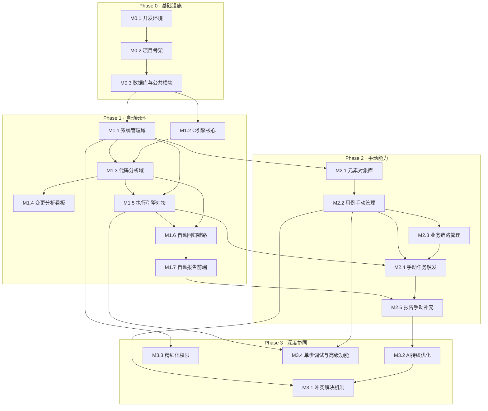

# DeltaTest 开发步骤设计

基于《整体架构重梳理》与《项目技术栈设计》，将开发分为 **5 个阶段**，每阶段按模块拆分，明确依赖关系、交付物与验收标准。阶段间串行推进，阶段内模块可并行。

---

## 阶段总览

```
Phase 0          Phase 1              Phase 2              Phase 3
基础设施 ──→ 变更驱动自动闭环 ──→ 手动录入触发能力 ──→ 双模式深度协同
(2周)          (8周)                (6周)                (4周)
```

| 阶段 | 目标 | 周期 | 核心交付 |
|------|------|------|----------|
| **Phase 0** | 基础设施与脚手架 | 2周 | 开发环境、CI/CD、项目骨架、数据库建表 |
| **Phase 1** | 变更驱动自动闭环 | 8周 | Git提交→自动分析→自动回归→自动报告 全链路 |
| **Phase 2** | 手动录入与触发 | 6周 | 用例CRUD、手动创建任务、手动补充报告 |
| **Phase 3** | 双模式深度协同 | 4周 | 冲突智能合并、AI持续优化、精细化权限、单步调试 |

---

## Phase 0：基础设施与脚手架（2周）

> 目标：搭建开发环境、CI/CD 流水线、四语言项目骨架、数据库初始化，为业务开发扫清障碍。

### M0.1 开发环境搭建（3天）

| 任务 | 负责栈 | 交付物 | 验收标准 |
|------|--------|--------|----------|
| 创建 Git 仓库与分支策略（main/develop/feature） | 全栈 | 仓库结构文档 | main/develop 分支可正常推送 |
| 搭建本地 K8s 开发集群（minikube/kind） | 运维 | K8s 集群 + namespace | `kubectl get nodes` 正常 |
| 部署中间件（MySQL/Redis/RabbitMQ/MinIO） | 运维 | docker-compose.yml + Helm charts | 所有中间件健康检查通过 |
| 配置 Maven 私服 / pnpm registry / PyPI mirror / Conan remote | 运维 | 私服配置文档 | 依赖可正常拉取 |

### M0.2 四语言项目骨架（4天）

| 任务 | 负责栈 | 交付物 | 验收标准 |
|------|--------|--------|----------|
| **Java 骨架**：Spring Boot 3.4 多模块项目 + MyBatis-Plus + Spring Security + SpringDoc | Java | 可启动的空项目 | `/actuator/health` 返回 UP |
| **Vue 骨架**：Vite + Vue3 + TS + Ant Design Vue + Pinia + Router | 前端 | 可启动的空页面 | `pnpm dev` 启动后可见登录页 |
| **Python 骨架**：FastAPI + uv + Pydantic + Ruff | Python | 可启动的空服务 | `/docs` 可访问 OpenAPI |
| **C 骨架**：CMake + Conan + gRPC Server 空壳 | C | 可编译的空项目 | `ctest` 通过 |
| Protobuf 定义：`code_analysis.proto` | Java + C | .proto 文件 + 双端生成的 Stub | Java/C 均可编译通过 |

### M0.3 数据库与公共模块（3天）

| 任务 | 负责栈 | 交付物 | 验收标准 |
|------|--------|--------|----------|
| 执行 DDL 建表 + 字典初始数据 | Java | Flyway 迁移脚本 | 全部表创建成功，字典数据可查询 |
| 统一响应体、全局异常处理、错误码枚举 | Java | common 模块 | 单元测试覆盖 |
| 统一日志格式（JSON 结构化日志） | Java + Python | 日志配置 | 日志输出符合格式 |
| 前端 API 调用层自动生成（OpenAPI Generator） | 前端 | api/ 目录 | 前端可调用 Java 健康检查接口 |

### Phase 0 里程碑验收

- [ ] 四个语言项目均可独立编译/启动
- [ ] 中间件全部健康运行
- [ ] 数据库表结构就绪，字典数据可查
- [ ] Java ↔ C gRPC 通信链路通畅（空请求可往返）
- [ ] Java ↔ Python HTTP 通信链路通畅

---

## Phase 1：变更驱动自动闭环（8周）

> 目标：实现 Git 提交 → Webhook 触发 → 自动分析 → 自动生成回归任务 → 自动执行 → 自动报告 的全链路闭环。

### M1.1 系统管理域（1周）

| 任务 | 优先级 | 负责栈 | 依赖 | 交付物 |
|------|--------|--------|------|--------|
| 用户管理 CRUD（含逻辑删除） | P0 | Java + Vue | M0.3 | 用户增删改查接口 + 前端页面 |
| RBAC 角色权限（角色/权限/关联表） | P0 | Java + Vue | M1.1-用户 | 角色权限管理页面 |
| JWT 登录认证 | P0 | Java + Vue | M1.1-用户 | 登录/登出/Token刷新 |
| Git 仓库配置 CRUD | P0 | Java + Vue | M1.1-权限 | 仓库管理页面，Webhook URL 生成 |
| 环境配置 CRUD | P1 | Java + Vue | M1.1-权限 | 环境管理页面 |
| 字典管理页面 | P1 | Java + Vue | M0.3-字典数据 | 字典类型/数据的增删改查页面 |

### M1.2 C 引擎核心能力（2周）

| 任务 | 优先级 | 负责栈 | 依赖 | 交付物 |
|------|--------|--------|------|--------|
| Diff 计算模块（libgit2 集成） | P0 | C | M0.2-C骨架 | gRPC `ComputeDiff` 接口可用 |
| 依赖链分析模块（tree-sitter 集成） | P0 | C | M0.2-C骨架 | gRPC `AnalyzeImpact` 接口可用 |
| 影响范围组装（分类输出） | P0 | C | M1.2-Diff + 依赖链 | 返回结构化影响范围 JSON |
| 单元测试 + 集成测试 | P0 | C | M1.2-各模块 | 核心用例测试覆盖 |
| Docker 镜像构建 + K8s 部署 | P1 | C + 运维 | M1.2-各模块 | 镜像可推送，Pod 可启动 |

### M1.3 代码分析域（1.5周）

| 任务 | 优先级 | 负责栈 | 依赖 | 交付物 |
|------|--------|--------|------|--------|
| Webhook 接收与解析 | P0 | Java | M1.1-仓库配置 | 接收 Git Webhook，解析提交信息 |
| 提交记录入库（git_commit） | P0 | Java | M1.3-Webhook | 提交记录自动写入 |
| 调用 C 引擎分析（gRPC） | P0 | Java | M1.2-C引擎 | 变更分析数据写入 change_analysis |
| 影响范围写入（affected_scope） | P0 | Java | M1.3-C调用 | 影响范围数据写入 |
| Python 风险评估接口 | P0 | Python | M1.3-影响范围 | 返回 risk_level + summary |
| Python Agent 架构骨架（BaseAgent + MasterAgent + 5 Sub-Agent） | P0 | Python | M1.3-影响范围 | Agent 编排层，Service 调用 Agent |
| Python Tool 注册框架（BaseTool + ToolRegistry + 装饰器） | P1 | Python | M1.3-Agent骨架 | 工具声明式注册与发现 |
| Java 调用 Python 风险评估 | P0 | Java | M1.3-Python | AI 分析结果写入 change_analysis |
| 自动匹配受影响用例 | P0 | Java | M1.3-影响范围 | case_analysis_relation 写入 |

### M1.4 变更分析前端看板（1周）

| 任务 | 优先级 | 负责栈 | 依赖 | 交付物 |
|------|--------|--------|------|--------|
| 提交记录列表页 | P0 | Vue | M1.3-提交入库 | 展示提交列表、风险等级、变更规模 |
| 变更详情面板（影响范围 + AI 摘要） | P0 | Vue | M1.3-完整分析 | 点击提交展示影响范围与AI建议 |
| 变更看板统计（今日提交/高风险/影响用例） | P1 | Vue | M1.4-列表页 | 顶部统计卡片 |

### M1.5 执行引擎对接（2周）

| 任务 | 优先级 | 负责栈 | 依赖 | 交付物 |
|------|--------|--------|------|--------|
| Playwright 执行节点基础框架 | P0 | Python | M0.2-Python骨架 | 可接收任务，执行简单用例 |
| 消息队列任务分发（RabbitMQ） | P0 | Java | M1.1-环境配置 | 任务发送到队列，节点消费执行 |
| 执行节点状态心跳 | P0 | Java | M1.5-MQ | exec_node 心跳更新 |
| 用例执行结果回传 | P0 | Java + Python | M1.5-执行框架 | task_execution 写入 |
| 步骤级结果记录 | P1 | Python | M1.5-结果回传 | execution_step_result 写入 |
| 截图/录像上传 MinIO | P1 | Python | M1.5-执行框架 | screenshot_url/video_url 写入 |

### M1.6 自动回归任务链路（1周）

| 任务 | 优先级 | 负责栈 | 依赖 | 交付物 |
|------|--------|--------|------|--------|
| 变更分析完成后自动生成回归任务 | P0 | Java | M1.3 + M1.5 | 分析完成 → 自动创建 test_task |
| 任务自动分发执行 | P0 | Java | M1.6-任务生成 | 任务发送到 MQ，节点领取执行 |
| 执行完成后自动生成报告 | P0 | Java | M1.5-结果回传 | test_report 自动写入 |
| Python AI 根因分析 | P1 | Python | M1.6-报告生成 | ai_root_cause 写入，由 RootCauseAgent 执行 |

### M1.7 自动报告前端（0.5周）

| 任务 | 优先级 | 负责栈 | 依赖 | 交付物 |
|------|--------|--------|------|--------|
| 报告列表页 | P0 | Vue | M1.6-报告生成 | 展示报告列表、通过率、状态 |
| 报告详情页（执行结果 + AI 根因） | P0 | Vue | M1.6-完整链路 | 展示失败用例 + AI 分析 |
| 任务状态列表页 | P1 | Vue | M1.5-执行框架 | 展示任务进度、通过/失败数 |

### Phase 1 里程碑验收

- [ ] 向 Git 仓库推送代码 → Webhook 自动触发 → 变更分析完成
- [ ] AI 风险评级与测试建议自动生成
- [ ] 受影响用例自动匹配
- [ ] 回归任务自动创建并分发到执行节点
- [ ] 执行完成后自动生成报告 + AI 根因分析
- [ ] 前端看板展示完整变更→测试→报告链路

---

## Phase 2：手动录入与触发能力（6周）

> 目标：补齐人工操作能力，用户可手动创建用例、手动触发任务、手动补充报告，实现双模式并行。

### M2.1 元素对象库（1周）

| 任务 | 优先级 | 负责栈 | 依赖 | 交付物 |
|------|--------|--------|------|--------|
| 元素 CRUD 接口 | P0 | Java | Phase 1 | page_element 增删改查 |
| 元素管理前端页面（定位符编辑 + 备份策略） | P0 | Vue | M2.1-接口 | 元素列表/新增/编辑页面 |
| 元素合法性校验（定位符格式检查） | P1 | Java | M2.1-接口 | 校验逻辑 + 错误提示 |

### M2.2 测试用例手动管理（2周）

| 任务 | 优先级 | 负责栈 | 依赖 | 交付物 |
|------|--------|--------|------|--------|
| 用例 CRUD 接口 | P0 | Java | M2.1-元素 | test_case + case_step 增删改查 |
| 用例版本管理（乐观锁 + 快照） | P0 | Java | M2.2-CRUD | case_version 自动写入 |
| 可视化步骤编排前端组件 | P0 | Vue | M2.2-接口 | 步骤拖拽/新增/删除/排序 |
| 步骤编排与元素库联动（选择元素填充定位符） | P0 | Vue | M2.1 + M2.2 | 元素下拉选择器 |
| 用例列表页（来源标签/健康度/受影响标记） | P0 | Vue | M2.2-接口 | 列表 + 筛选 + 标签展示 |
| 用例标签管理 | P2 | Java + Vue | M2.2-CRUD | 标签增删改查 + 用例打标签 |

### M2.3 业务链路管理（1周）

| 任务 | 优先级 | 负责栈 | 依赖 | 交付物 |
|------|--------|--------|------|--------|
| 链路 CRUD 接口（含节点） | P1 | Java | M2.2-用例 | business_link + link_node 增删改查 |
| 链路可视化编排前端组件（@vue-flow） | P1 | Vue | M2.3-接口 | 拖拽节点、连线、排序 |
| 用例与链路关联 | P1 | Java + Vue | M2.2 + M2.3 | 关联/解除关联操作 |

### M2.4 手动任务创建与触发（1周）

| 任务 | 优先级 | 负责栈 | 依赖 | 交付物 |
|------|--------|--------|------|--------|
| 手动创建任务接口（选用例/链路/模块） | P0 | Java | M2.2 + M2.3 | 任务创建 + task_case_relation |
| 执行配置（环境/浏览器/并发/重试） | P1 | Java | M1.5-执行框架 | 配置项写入 test_task |
| 手动触发/暂停/终止任务 | P0 | Java + Python | M2.4-创建 | 任务状态变更 + 通知执行节点 |
| 任务创建前端页面 | P0 | Vue | M2.4-接口 | 创建任务对话框 + 执行配置 |
| 实时日志推送（WebSocket） | P0 | Java + Vue | M1.5-执行框架 | 日志面板实时滚动展示 |
| 手动发起代码分析 | P0 | Java + Vue | M1.3-分析 | 选择分支+commit范围发起分析 |
| Agent 异步触发接口（POST /api/agent/trigger） | P1 | Java + Python | M1.3-Agent骨架 | Java 异步触发 Agent 分析任务 |
| Agent 工具实现（ExecutionLogTool + ManualFailureMarkTool + PageElementTool + BusinessLinkTool） | P1 | Python | M2.1 + M2.2 | Agent 可通过 HTTP 获取 Java 后端数据 |
| Agent 降级策略实现 | P1 | Python | M1.3-Agent骨架 | LLM 不可用时自动降级到规则引擎 |

### M2.5 报告手动补充（1周）

| 任务 | 优先级 | 负责栈 | 依赖 | 交付物 |
|------|--------|--------|------|--------|
| 手动标记失败原因接口 | P1 | Java | Phase 1 | manual_failure_mark 写入 |
| 缺陷录入接口（关联用例+提交） | P1 | Java | M2.5-标记 | defect_record 写入 |
| 报告结论/备注手动调整 | P2 | Java | Phase 1 | manual_conclusion/remark 更新 |
| 失败原因标记前端对话框 | P1 | Vue | M2.5-标记 | 标记弹窗 + 原因选择 |
| 缺陷录入前端对话框 | P1 | Vue | M2.5-缺陷 | 录入弹窗 + 关联选择 |
| 报告导出（PDF/Excel） | P2 | Java + Vue | M2.5-报告 | 导出下载 |
| 风险等级手动调整 | P1 | Java + Vue | M1.3 | 调整弹窗 + 原因填写 |

### Phase 2 里程碑验收

- [ ] 可手动新增用例，通过可视化步骤编排配置操作和断言
- [ ] 可手动创建任务并触发执行，实时查看日志
- [ ] 可手动发起代码影响分析
- [ ] 报告中可手动标记失败原因、录入缺陷
- [ ] 手动录入的用例/元素/链路，变更驱动时可被自动匹配
- [ ] 手动标记的失败原因数据可用于 AI 训练

---

## Phase 3：双模式深度协同（4周）

> 目标：自动与手动深度互哺，平台能力趋于成熟。

### M3.1 冲突解决机制（1周）

| 任务 | 优先级 | 负责栈 | 依赖 | 交付物 |
|------|--------|--------|------|--------|
| 用例冲突检测（自动生成 vs 手动修改） | P1 | Java | Phase 2 | 检测到同范围用例时标记"建议更新" |
| 用例合并选择前端页面 | P1 | Vue | M3.1-检测 | 展示差异，用户选择保留/合并 |
| source 字段自动流转（auto→hybrid） | P1 | Java | M3.1-冲突 | 手动修改后 source 自动更新 |
| 风险等级冲突（手动 vs AI）保留双值 | P1 | Java | Phase 2 | risk_level + risk_level_manual 并存展示 |

### M3.2 AI 持续优化（1周）

| 任务 | 优先级 | 负责栈 | 依赖 | 交付物 |
|------|--------|--------|------|--------|
| 手动标记数据反馈训练（失败原因→AI 模型） | P1 | Python | M2.5-标记 | 手动标记数据自动进入训练集 |
| 用例相似度语义检索（Embedding + Milvus） | P1 | Python | Phase 2 | 新变更可用语义匹配更精准的用例 |
| AI 用例自动生成优化（Prompt 迭代） | P2 | Python | M3.2-语义检索 | 生成用例质量提升 |
| AI 分析降级策略完善 | P1 | Java + Python | Phase 1 | AI 不可用时自动降级 + 补充分析 |
| Agent 对话式交互接口（POST /api/agent/chat） | P1 | Python | M1.3-Agent | 多轮对话式 Agent 交互 |
| Agent 短期记忆（Redis） | P1 | Python | M3.2-Agent对话 | 会话上下文保持，TTL 30 分钟 |
| Agent 长期记忆（agent_memory 表） | P2 | Python | M3.2-短期记忆 | 历史模式学习 + 反馈训练闭环 |
| Agent Human-in-the-Loop 检查点 | P1 | Java + Python + Vue | M3.2-Agent对话 | 风险调整确认 + 用例确认 + 失败标记 |
| Agent 流式 WebSocket 推送（agent_progress/agent_result 消息类型） | P2 | Java + Vue | M3.2-Agent对话 | Agent 进度实时可见 |
| Agent Milvus 向量检索迁移 | P2 | Python | M3.2-语义检索 | 语义匹配从 MySQL 关键字升级为向量相似度 |

### M3.3 精细化权限与安全（1周）

| 任务 | 优先级 | 负责栈 | 依赖 | 交付物 |
|------|--------|--------|------|--------|
| 前端菜单/按钮级权限控制 | P1 | Vue | M1.1-RBAC | 根据权限隐藏菜单/禁用按钮 |
| 数据级权限（按项目/模块隔离） | P2 | Java | M1.1-RBAC | 不同用户可见不同项目数据 |
| 操作审计日志 | P2 | Java | Phase 2 | 关键操作记录审计轨迹 |
| API 接口签名校验 | P2 | Java | M1.1-JWT | 防止接口被未授权调用 |

### M3.4 单步调试与高级功能（1周）

| 任务 | 优先级 | 负责栈 | 依赖 | 交付物 |
|------|--------|--------|------|--------|
| 单步调试协议设计（Playwright 侧） | P2 | Python | M1.5 | 逐步执行 + 暂停 + 检查变量 |
| 单步调试前端交互 | P2 | Vue | M3.4-协议 | 步骤级执行控制面板 |
| 定时任务调度（CRON 配置 + 自动触发） | P1 | Java | M1.6 | 定时任务自动创建+执行 |
| 执行节点弹性伸缩（HPA） | P2 | 运维 | M1.5 | K8s HPA 配置 + 压测验证 |
| 外部用例导入（JSON/Excel/CSV） | P2 | Java + Vue | M2.2 | 导入对话框 + 数据校验 |
| 测试数据集 / 环境变量管理 | P2 | Java + Vue | M2.2 | 数据集 CRUD + 参数化替换 |

### Phase 3 里程碑验收

- [ ] 用例冲突时可展示差异，用户可选择合并策略
- [ ] 手动标记数据可反馈 AI 训练，根因分析准确率提升
- [ ] 语义匹配可找到更精准的受影响用例
- [ ] Agent 对话式交互可用，支持多轮对话
- [ ] Agent 短期/长期记忆生效，分析结果可持续学习
- [ ] Agent Human-in-the-Loop 检查点可正常工作
- [ ] 前端菜单/按钮按权限控制
- [ ] 定时任务可自动触发执行
- [ ] 单步调试可逐步执行用例

---

## 依赖关系图



---

## 各阶段人力分配建议

| 角色 | Phase 0 | Phase 1 | Phase 2 | Phase 3 |
|------|---------|---------|---------|---------|
| **Java 后端** | 1人（骨架+建表） | 2人（系统域+分析域+执行域） | 2人（用例管理+任务+报告） | 1人（冲突+权限+审计） |
| **Vue 前端** | 1人（骨架+页面框架） | 1人（看板+报告+任务列表） | 1.5人（步骤编排+任务创建+报告补充） | 0.5人（冲突合并+调试面板） |
| **C 引擎** | 1人（骨架+Proto） | 1人（Diff+依赖链+gRPC） | 0人 | 0人 |
| **Python AI** | 1人（骨架+风险评估接口） | 1人（Agent架构+风险评级+根因分析+Playwright框架） | 0.5人（执行节点完善+Agent工具） | 1人（语义检索+Agent对话+记忆+AI优化） |
| **运维** | 1人（K8s+中间件+CI/CD） | 0.5人（镜像+部署） | 0人 | 0.5人（HPA+监控） |
| **合计** | **5人** | **5.5人** | **4人** | **3人** |

---

## 风险与应对

| 风险 | 阶段 | 影响 | 应对措施 |
|------|------|------|----------|
| tree-sitter 对特定语言支持不足 | Phase 1 | 依赖链分析覆盖不全 | 先支持 Java/JS/Python 主流语言，小众语言降级为正则匹配 |
| AI 风险评估准确率不够 | Phase 1 | 误判风险等级 | 初期仅作参考值，手动可覆盖；持续收集反馈优化 |
| Playwright 执行环境差异 | Phase 1 | 用例在不同节点结果不一致 | 统一 Docker 镜像，固定浏览器版本 |
| 步骤编排组件复杂度高 | Phase 2 | 开发延期 | 先实现基础版（线性步骤），Phase 3 补充条件分支 |
| gRPC 跨语言调试困难 | Phase 0 | Java↔C 联调效率低 | 使用 grpcurl 命令行工具独立调试 C 引擎 |

---

## 每模块开发规范

每个模块开发需遵循以下流水线：

```
需求确认 → 技术设计(API/表结构/接口) → 编码 → 单元测试 → 联调 → Code Review → 合并
```

| 环节 | 要求 |
|------|------|
| 需求确认 | 对应架构文档中的能力项，明确 P0/P1/P2 |
| 技术设计 | API 设计先行，前后端对齐接口再开发 |
| 编码 | 遵循各语言规范（ESLint/Ruff/Checkstyle），逻辑删除全局生效 |
| 单元测试 | 核心逻辑覆盖率 ≥ 80% |
| 联调 | 前后端联调、Java↔Python/C 联调 |
| Code Review | 至少 1 人 Review 通过后方可合并 |
