# DeltaTest 数据库表关系全景分析

> 基于 `delta-test-admin/src/main/resources/db/migration/V1__create_all_tables.sql`  
> 数据库：MySQL 8.0+ | 字符集：utf8mb4 | 总计：39 张表

---

## 一、总览

共 **39 张表**，分布在 6 个业务域中。数据库**未使用物理外键（FOREIGN KEY）**，所有跨表引用均为**逻辑外键**（通过字段命名约定 `xxx_id` 关联），这是项目的设计选择——用应用层保证引用完整性，换取更灵活的数据迁移和分区能力。

| 域 | 表数量 | 核心表 |
|---|---|---|
| 一、系统管理域 | 9 | sys_user, sys_role, sys_permission |
| 二、代码分析域 | 4 | change_analysis, git_commit |
| 三、测试管理域 | 12 | test_case, business_link, page_element |
| 四、执行管控域 | 5 | test_task, task_execution |
| 五、质量报表域 | 6 | test_report, defect_record |
| 六、智能体域 | 3 | agent_conversation, agent_memory |

---

## 二、各表主键与逻辑外键清单

### 域一：系统管理域（9 表）

| # | 表名 | PK | UK | 逻辑 FK | 引用目标 |
|---|---|---|---|---|---|
| 1 | `sys_user` | id | username | — | 被 8 张表引用（created_by/modified_by/marked_by/trigger_user_id） |
| 2 | `sys_role` | id | role_code | — | 被 sys_user_role 引用 |
| 3 | `sys_permission` | id | permission_code | `parent_id` → `sys_permission.id` | 自引用（树形结构）；被 sys_role_permission 引用 |
| 4 | `sys_user_role` | id | user_id+role_id | `user_id` → `sys_user.id`<br>`role_id` → `sys_role.id` | 多对多中间表 |
| 5 | `sys_role_permission` | id | role_id+permission_id | `role_id` → `sys_role.id`<br>`permission_id` → `sys_permission.id` | 多对多中间表 |
| 6 | `sys_environment` | id | env_code | — | 被 test_case.env_id、test_task.env_id、env_variable.env_id 引用 |
| 7 | `sys_repository` | id | — | — | 被 git_commit.repo_id、change_analysis.repo_id 引用 |
| 8 | `sys_dict_type` | id | dict_type | `created_by` → `sys_user.id` | 被 sys_dict_data.dict_type 逻辑引用 |
| 9 | `sys_dict_data` | id | dict_type+dict_value | `dict_type` → `sys_dict_type.dict_type`<br>`created_by` → `sys_user.id` | 字典值归属字典类型 |

### 域二：代码分析域（4 表）

| # | 表名 | PK | UK | 逻辑 FK | 引用目标 |
|---|---|---|---|---|---|
| 10 | `git_commit` | id | repo_id+commit_hash | `repo_id` → `sys_repository.id` | 被 change_analysis_commit、defect_record 引用 |
| 11 | `change_analysis` | id | analysis_no | `repo_id` → `sys_repository.id`<br>`trigger_user_id` → `sys_user.id` | 被 4 张表引用（核心枢纽） |
| 12 | `change_analysis_commit` | id | analysis_id+commit_id | `analysis_id` → `change_analysis.id`<br>`commit_id` → `git_commit.id` | 多对多中间表 |
| 13 | `affected_scope` | id | — | `analysis_id` → `change_analysis.id` | 从属于变更分析 |

### 域三：测试管理域（12 表）

| # | 表名 | PK | UK | 逻辑 FK | 引用目标 |
|---|---|---|---|---|---|
| 14 | `page_element` | id | element_code | — | 被 case_step.element_id 引用 |
| 15 | `test_case` | id | case_no | `env_id` → `sys_environment.id`<br>`created_by` → `sys_user.id`<br>`last_modified_by` → `sys_user.id` | 被 7 张表引用（最核心表） |
| 16 | `case_step` | id | — | `case_id` → `test_case.id`<br>`element_id` → `page_element.id` | 从属于用例 |
| 17 | `case_version` | id | case_id+version | `case_id` → `test_case.id`<br>`modified_by` → `sys_user.id` | 用例快照历史 |
| 18 | `case_tag` | id | tag_name | — | 被 case_tag_relation 引用 |
| 19 | `case_tag_relation` | id | case_id+tag_id | `case_id` → `test_case.id`<br>`tag_id` → `case_tag.id` | 多对多中间表 |
| 20 | `business_link` | id | link_no | `created_by` → `sys_user.id`<br>`last_modified_by` → `sys_user.id` | 被 link_node、case_link_relation 引用 |
| 21 | `link_node` | id | — | `link_id` → `business_link.id` | 从属于业务链路 |
| 22 | `case_link_relation` | id | case_id+link_id | `case_id` → `test_case.id`<br>`link_id` → `business_link.id` | 多对多中间表 |
| 23 | `case_analysis_relation` | id | case_id+analysis_id | `case_id` → `test_case.id`<br>`analysis_id` → `change_analysis.id` | 多对多中间表 |
| 24 | `test_data_set` | id | — | `created_by` → `sys_user.id` | 独立实体 |
| 25 | `env_variable` | id | env_id+var_key | `env_id` → `sys_environment.id` | 从属于环境（NULL=全局） |

### 域四：执行管控域（5 表）

| # | 表名 | PK | UK | 逻辑 FK | 引用目标 |
|---|---|---|---|---|---|
| 26 | `exec_node` | id | — | — | 被 task_execution.node_id 引用 |
| 27 | `test_task` | id | task_no | `trigger_user_id` → `sys_user.id`<br>`analysis_id` → `change_analysis.id`<br>`env_id` → `sys_environment.id` | 被 3 张表引用 |
| 28 | `task_case_relation` | id | task_id+case_id | `task_id` → `test_task.id`<br>`case_id` → `test_case.id` | 多对多中间表 |
| 29 | `task_execution` | id | — | `task_id` → `test_task.id`<br>`case_id` → `test_case.id`<br>`node_id` → `exec_node.id` | 被 5 张表引用（执行层核心） |
| 30 | `execution_step_result` | id | — | `execution_id` → `task_execution.id` | 从属于执行记录 |

### 域五：质量报表域（6 表）

| # | 表名 | PK | UK | 逻辑 FK | 引用目标 |
|---|---|---|---|---|---|
| 31 | `test_report` | id | report_no | `task_id` → `test_task.id` | 被 3 张表引用 |
| 32 | `report_execution_relation` | id | report_id+execution_id | `report_id` → `test_report.id`<br>`execution_id` → `task_execution.id` | 多对多中间表 |
| 33 | `ai_root_cause` | id | — | `execution_id` → `task_execution.id`<br>`report_id` → `test_report.id` | 从属于执行+报告 |
| 34 | `manual_failure_mark` | id | execution_id | `execution_id` → `task_execution.id`<br>`marked_by` → `sys_user.id` | 与执行记录一对一 |
| 35 | `defect_record` | id | defect_no | `execution_id` → `task_execution.id`<br>`case_id` → `test_case.id`<br>`commit_id` → `git_commit.id`<br>`report_id` → `test_report.id`<br>`created_by` → `sys_user.id`<br>`resolved_by` → `sys_user.id` | 关联最广（6 个 FK） |
| 36 | `quality_daily_stats` | id | stat_date | — | 独立聚合表，无 FK |

### 域六：智能体域（3 表）

| # | 表名 | PK | UK | 逻辑 FK | 引用目标 |
|---|---|---|---|---|---|
| 37 | `agent_conversation` | id | — | — | 被 agent_tool_call.session_id 逻辑引用 |
| 38 | `agent_memory` | id | — | `source_type`+`source_id` → 多态引用 | 多态引用（见下方说明） |
| 39 | `agent_tool_call` | id | — | `session_id` → `agent_conversation.session_id` | 从属于对话会话 |

---

## 三、关联类型分析

### 3.1 一对多关系（1:N）—— 共 24 条

| 主表 | 从表 | FK 字段 | 说明 |
|---|---|---|---|
| `sys_user` | `sys_user_role` | user_id | 一个用户拥有多个角色 |
| `sys_role` | `sys_user_role` | role_id | 一个角色被多个用户持有 |
| `sys_role` | `sys_role_permission` | role_id | 一个角色拥有多个权限 |
| `sys_permission` | `sys_role_permission` | permission_id | 一个权限被多个角色持有 |
| `sys_permission` | `sys_permission` | parent_id | 父权限包含多个子权限（树形自引用） |
| `sys_repository` | `git_commit` | repo_id | 一个仓库有多次提交 |
| `sys_repository` | `change_analysis` | repo_id | 一个仓库触发多次分析 |
| `change_analysis` | `change_analysis_commit` | analysis_id | 一次分析包含多个提交 |
| `git_commit` | `change_analysis_commit` | commit_id | 一次提交被多次分析引用 |
| `change_analysis` | `affected_scope` | analysis_id | 一次分析识别多个影响范围 |
| `test_case` | `case_step` | case_id | 一个用例包含多个步骤 |
| `page_element` | `case_step` | element_id | 一个元素被多个步骤引用 |
| `test_case` | `case_version` | case_id | 一个用例有多个版本快照 |
| `business_link` | `link_node` | link_id | 一个链路包含多个节点 |
| `change_analysis` | `case_analysis_relation` | analysis_id | 一次分析影响多个用例 |
| `test_case` | `case_analysis_relation` | case_id | 一个用例被多次分析影响 |
| `test_task` | `task_case_relation` | task_id | 一个任务包含多个用例 |
| `test_task` | `task_execution` | task_id | 一个任务产生多条执行记录 |
| `exec_node` | `task_execution` | node_id | 一个节点执行多个用例实例 |
| `task_execution` | `execution_step_result` | execution_id | 一条执行记录包含多个步骤结果 |
| `test_task` | `test_report` | task_id | 一个任务生成一份报告 |
| `task_execution` | `ai_root_cause` | execution_id | 一条执行记录可触发多次 AI 分析 |
| `task_execution` | `manual_failure_mark` | execution_id | 一条失败执行可被标记一次（1:1） |
| `sys_environment` | `env_variable` | env_id | 一个环境有多个变量 |

### 3.2 多对多关系（M:N）—— 共 8 条（均通过中间表实现）

| 表A | 中间表 | 表B | 中间表 UK | 说明 |
|---|---|---|---|---|
| `sys_user` | `sys_user_role` | `sys_role` | user_id+role_id | 用户 ↔ 角色 |
| `sys_role` | `sys_role_permission` | `sys_permission` | role_id+permission_id | 角色 ↔ 权限 |
| `change_analysis` | `change_analysis_commit` | `git_commit` | analysis_id+commit_id | 变更分析 ↔ 提交记录 |
| `test_case` | `case_tag_relation` | `case_tag` | case_id+tag_id | 用例 ↔ 标签 |
| `test_case` | `case_link_relation` | `business_link` | case_id+link_id | 用例 ↔ 业务链路 |
| `test_case` | `case_analysis_relation` | `change_analysis` | case_id+analysis_id | 用例 ↔ 变更分析（含受影响类型+处理状态） |
| `test_task` | `task_case_relation` | `test_case` | task_id+case_id | 任务 ↔ 用例 |
| `test_report` | `report_execution_relation` | `task_execution` | report_id+execution_id | 报告 ↔ 执行记录 |

### 3.3 一对一关系（1:1）—— 共 1 条

| 主表 | 从表 | UK 约束 | 说明 |
|---|---|---|---|
| `task_execution` | `manual_failure_mark` | uk_execution | 一条执行记录最多一个手动失败标记 |

### 3.4 特殊关联模式

#### 多态引用（Polymorphic Reference）

| 表 | 字段组合 | 说明 |
|---|---|---|
| `agent_memory` | `source_type` + `source_id` | source_type 决定 source_id 指向哪张表：`risk_analysis` → `change_analysis.id`，`root_cause` → `ai_root_cause.id`，`manual_mark` → `manual_failure_mark.id` |

#### 会话聚合（Session Aggregation）

| 表 | 字段 | 说明 |
|---|---|---|
| `agent_conversation` | `session_id` | 非物理关联，同一 session_id 的多条记录属于同一次对话 |
| `agent_tool_call` | `session_id` | 逻辑关联到 agent_conversation 的同一会话 |

#### 跨域聚合实体

| 表 | 关联域 | 说明 |
|---|---|---|
| `defect_record` | 执行管控 + 测试管理 + 代码分析 + 质量报表 | 同时关联 execution_id、case_id、commit_id、report_id、created_by、resolved_by（6 个 FK），是唯一横跨 4 个域的聚合实体 |

---

## 四、核心引用热度排名（入度分析）

| 排名 | 表名 | 被引用次数 | 角色 |
|---|---|---|---|
| 1 | `sys_user` | **8** | 全局操作人/审计人（created_by/modified_by/marked_by/trigger_user_id） |
| 2 | `test_case` | **7** | 测试管理核心（case_step/case_version/tag/link/analysis/task_relation/defect） |
| 3 | `task_execution` | **5** | 执行层核心（step_result/report_relation/ai_root_cause/manual_mark/defect） |
| 4 | `change_analysis` | **4** | 代码分析核心（commit/scope/case_relation/task） |
| 5 | `sys_environment` | **3** | 环境上下文（test_case/test_task/env_variable） |
| 5 | `test_task` | **3** | 任务编排核心（case_relation/execution/report） |
| 5 | `test_report` | **3** | 报告核心（execution_relation/ai_root_cause/defect） |
| 5 | `sys_repository` | **2** | 仓库上下文（git_commit/change_analysis） |

---

## 五、全量关系图（Mermaid）

```mermaid
erDiagram
    %% ==================== 系统管理域 ====================
    sys_user ||--o{ sys_user_role : "user_id"
    sys_role ||--o{ sys_user_role : "role_id"
    sys_role ||--o{ sys_role_permission : "role_id"
    sys_permission ||--o{ sys_role_permission : "permission_id"
    sys_permission ||--o{ sys_permission : "parent_id 自引用"

    sys_dict_type ||--o{ sys_dict_data : "dict_type"

    %% ==================== 代码分析域 ====================
    sys_repository ||--o{ git_commit : "repo_id"
    sys_repository ||--o{ change_analysis : "repo_id"
    sys_user ||--o{ change_analysis : "trigger_user_id"

    change_analysis ||--o{ change_analysis_commit : "analysis_id"
    git_commit ||--o{ change_analysis_commit : "commit_id"
    change_analysis ||--o{ affected_scope : "analysis_id"

    %% ==================== 测试管理域 ====================
    sys_environment ||--o{ test_case : "env_id"
    sys_user ||--o{ test_case : "created_by"

    test_case ||--o{ case_step : "case_id"
    page_element ||--o{ case_step : "element_id"
    test_case ||--o{ case_version : "case_id"
    test_case ||--o{ case_tag_relation : "case_id"
    case_tag ||--o{ case_tag_relation : "tag_id"
    test_case ||--o{ case_link_relation : "case_id"
    business_link ||--o{ case_link_relation : "link_id"
    business_link ||--o{ link_node : "link_id"

    test_case ||--o{ case_analysis_relation : "case_id"
    change_analysis ||--o{ case_analysis_relation : "analysis_id"

    sys_environment ||--o{ env_variable : "env_id"

    %% ==================== 执行管控域 ====================
    sys_user ||--o{ test_task : "trigger_user_id"
    change_analysis ||--o{ test_task : "analysis_id"
    sys_environment ||--o{ test_task : "env_id"

    test_task ||--o{ task_case_relation : "task_id"
    test_case ||--o{ task_case_relation : "case_id"

    test_task ||--o{ task_execution : "task_id"
    test_case ||--o{ task_execution : "case_id"
    exec_node ||--o{ task_execution : "node_id"

    task_execution ||--o{ execution_step_result : "execution_id"

    %% ==================== 质量报表域 ====================
    test_task ||--|{ test_report : "task_id"
    test_report ||--o{ report_execution_relation : "report_id"
    task_execution ||--o{ report_execution_relation : "execution_id"

    task_execution ||--o{ ai_root_cause : "execution_id"
    test_report ||--o{ ai_root_cause : "report_id"

    task_execution ||--o| manual_failure_mark : "execution_id"
    sys_user ||--o{ manual_failure_mark : "marked_by"

    task_execution ||--o{ defect_record : "execution_id"
    test_case ||--o{ defect_record : "case_id"
    git_commit ||--o{ defect_record : "commit_id"
    test_report ||--o{ defect_record : "report_id"
    sys_user ||--o{ defect_record : "created_by"

    %% ==================== 智能体域 ====================
    agent_conversation ||--o{ agent_tool_call : "session_id"
```



---

## 六、跨域数据流

```
Git Webhook / 手动触发
        │
        ▼
┌─────────────────────────┐
│  sys_repository          │ ← 仓库配置（认证、分支）
│  git_commit              │ ← 提交记录
│  change_analysis         │ ← 变更分析（AI风险评级）
│  change_analysis_commit  │ ← 分析↔提交关联
│  affected_scope          │ ← 影响范围
└───────────┬─────────────┘
            │ case_analysis_relation
            ▼
┌─────────────────────────┐
│  test_case               │ ← 测试用例（手动/AI生成/混合）
│  case_step               │ ← 步骤（元素+动作+断言）
│  case_version            │ ← 版本快照
│  page_element            │ ← 页面元素库
│  business_link           │ ← 业务链路
│  link_node               │ ← 链路节点
│  case_tag                │ ← 标签
└───────────┬─────────────┘
            │ task_case_relation
            ▼
┌─────────────────────────┐
│  test_task               │ ← 执行任务（自动/手动/定时）
│  exec_node               │ ← Playwright 执行节点
│  task_execution          │ ← 单条用例执行实例
│  execution_step_result   │ ← 步骤级执行结果
└───────────┬─────────────┘
            │
            ▼
┌─────────────────────────┐
│  test_report             │ ← 测试报告
│  ai_root_cause           │ ← AI 根因分析
│  manual_failure_mark     │ ← 手动失败标记
│  defect_record           │ ← 缺陷记录（跨域聚合）
│  quality_daily_stats     │ ← 质量日统计
└───────────┬─────────────┘
            │
            ▼
┌─────────────────────────┐
│  agent_conversation      │ ← Agent 对话
│  agent_memory            │ ← Agent 长期记忆
│  agent_tool_call         │ ← Agent 工具调用
└─────────────────────────┘
```

---

## 七、设计特征总结

1. **无物理外键**：全部 39 张表均未声明 `FOREIGN KEY` 约束，跨表一致性由应用层（Java Service）保证，便于数据迁移和分库分表
2. **雪花 ID + 逻辑删除**：所有表使用 `BIGINT NOT NULL` 雪花 ID（无 AUTO_INCREMENT），配合 `is_deleted` 软删除
3. **中间表模式统一**：8 个多对多中间表均遵循 `xxx_id + yyy_id + UK + idx_is_deleted` 模式
4. **字典驱动枚举**：所有枚举字段（status、type、source 等）的值域由 `sys_dict_type` + `sys_dict_data` 统一管理
5. **双模式贯穿**：`trigger_source`(auto/manual)、`source`(auto/manual/hybrid) 字段贯穿代码分析→测试管理→执行管控全链路，体现"双模式驱动"架构
6. **跨域聚合点**：`defect_record` 是唯一横跨 4 个域（执行→用例→提交→报告）的聚合实体；`change_analysis` 是代码分析域→测试管理域的关键桥梁
7. **审计字段统一**：所有含 `created_by`/`modified_by`/`marked_by` 的表均逻辑引用 `sys_user.id`，实现操作溯源
